# Half Adder and Full Adder using Verilog

## Project Overview

This is a beginner-level digital logic design project using **Verilog HDL**.  
The project implements a **Half Adder** and a **Full Adder**, then verifies their outputs using all possible input combinations.

This project is part of my learning journey as a **Hardware Enthusiast**. Through this project, I practiced combinational logic design, binary addition, Verilog module connection, simulation, and GitHub project documentation.

---

## Circuits Implemented

This project includes:

- Half Adder
- Full Adder

---

## Tools Used

- Verilog HDL
- ModelSim
- GitHub

---

## Project Files

| File Name | Description |
|---|---|
| `README.md` | Project documentation |
| `half_adder.v` | Verilog design file for Half Adder |
| `full_adder.v` | Verilog design file for Full Adder |
| `half_adder_tb.v` | Testbench file for Half Adder |
| `full_adder_tb.v` | Testbench file for Full Adder |
| `half_adder_a0_b0.png` | Half Adder output for A = 0, B = 0 |
| `half_adder_a0_b1.png` | Half Adder output for A = 0, B = 1 |
| `half_adder_a1_b0.png` | Half Adder output for A = 1, B = 0 |
| `half_adder_a1_b1.png` | Half Adder output for A = 1, B = 1 |
| `full_adder_a0_b0_cin0.png` | Full Adder output for A = 0, B = 0, Cin = 0 |
| `full_adder_a0_b0_cin1.png` | Full Adder output for A = 0, B = 0, Cin = 1 |
| `full_adder_a0_b1_cin0.png` | Full Adder output for A = 0, B = 1, Cin = 0 |
| `full_adder_a0_b1_cin1.png` | Full Adder output for A = 0, B = 1, Cin = 1 |
| `full_adder_a1_b0_cin0.png` | Full Adder output for A = 1, B = 0, Cin = 0 |
| `full_adder_a1_b0_cin1.png` | Full Adder output for A = 1, B = 0, Cin = 1 |
| `full_adder_a1_b1_cin0.png` | Full Adder output for A = 1, B = 1, Cin = 0 |
| `full_adder_a1_b1_cin1.png` | Full Adder output for A = 1, B = 1, Cin = 1 |

---

## Half Adder

A **Half Adder** is a combinational logic circuit that adds two single-bit binary inputs.  
It produces two outputs: `sum` and `carry`.

### Half Adder Inputs and Outputs

| Signal Name | Type | Description |
|---|---|---|
| `a` | Input | First input bit |
| `b` | Input | Second input bit |
| `sum` | Output | Sum output |
| `carry` | Output | Carry output |

### Half Adder Truth Table

| A | B | Sum | Carry |
|---|---|---|---|
| 0 | 0 | 0 | 0 |
| 0 | 1 | 1 | 0 |
| 1 | 0 | 1 | 0 |
| 1 | 1 | 0 | 1 |

---

## Full Adder

A **Full Adder** is a combinational logic circuit that adds three single-bit inputs: `a`, `b`, and `cin`.  
It produces two outputs: `sum` and `cout`.

### Full Adder Inputs and Outputs

| Signal Name | Type | Description |
|---|---|---|
| `a` | Input | First input bit |
| `b` | Input | Second input bit |
| `cin` | Input | Carry input |
| `sum` | Output | Sum output |
| `cout` | Output | Carry output |

### Full Adder Truth Table

| A | B | Cin | Sum | Cout |
|---|---|---|---|---|
| 0 | 0 | 0 | 0 | 0 |
| 0 | 0 | 1 | 1 | 0 |
| 0 | 1 | 0 | 1 | 0 |
| 0 | 1 | 1 | 0 | 1 |
| 1 | 0 | 0 | 1 | 0 |
| 1 | 0 | 1 | 0 | 1 |
| 1 | 1 | 0 | 0 | 1 |
| 1 | 1 | 1 | 1 | 1 |

---

## Simulation Screenshots

The Half Adder and Full Adder circuits were tested using all possible input combinations.

---

## Half Adder Simulation Screenshots

### Input Combination: A = 0, B = 0

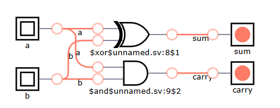

---

### Input Combination: A = 0, B = 1

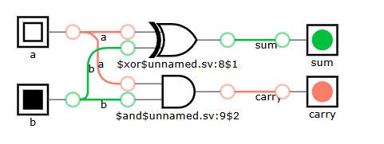

---

### Input Combination: A = 1, B = 0

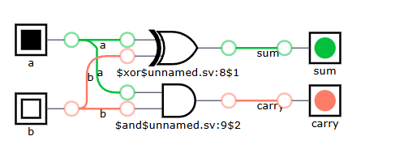

---

### Input Combination: A = 1, B = 1

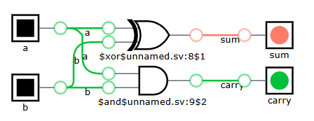

---

## Full Adder Simulation Screenshots

### Input Combination: A = 0, B = 0, Cin = 0

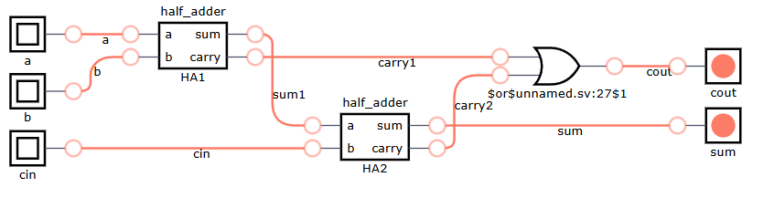

---

### Input Combination: A = 0, B = 0, Cin = 1

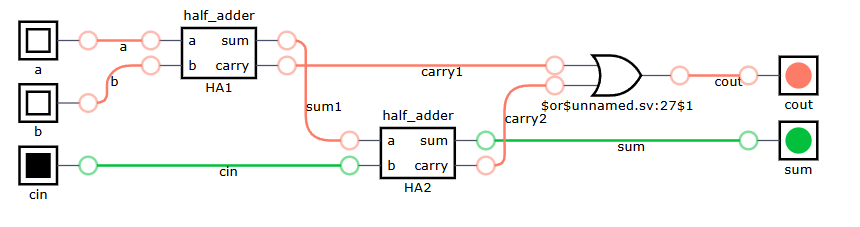

---

### Input Combination: A = 0, B = 1, Cin = 0

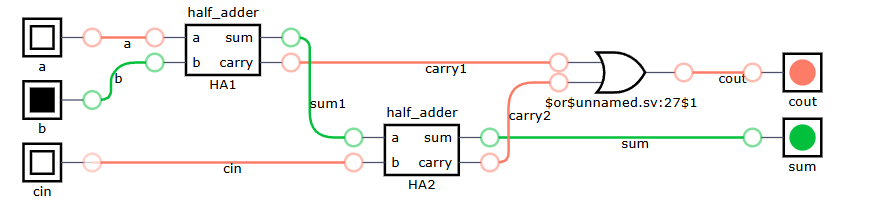

---

### Input Combination: A = 0, B = 1, Cin = 1

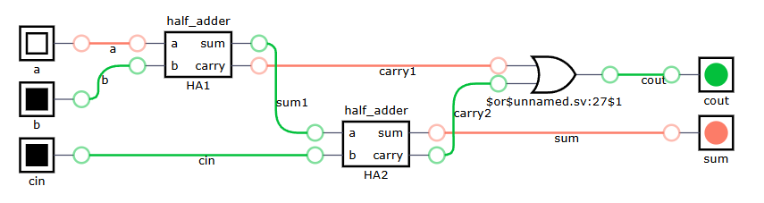

---

### Input Combination: A = 1, B = 0, Cin = 0

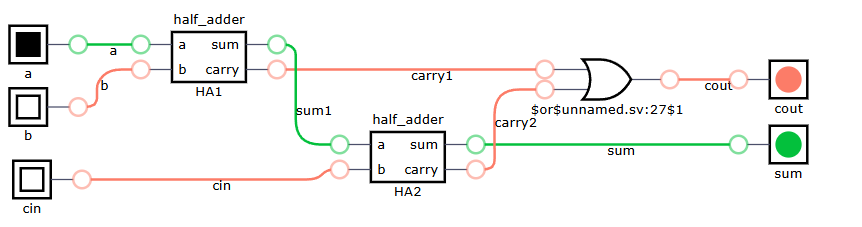

---

### Input Combination: A = 1, B = 0, Cin = 1

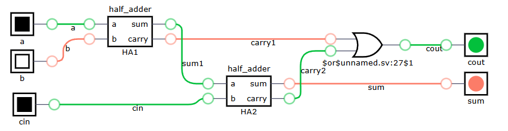

---

### Input Combination: A = 1, B = 1, Cin = 0

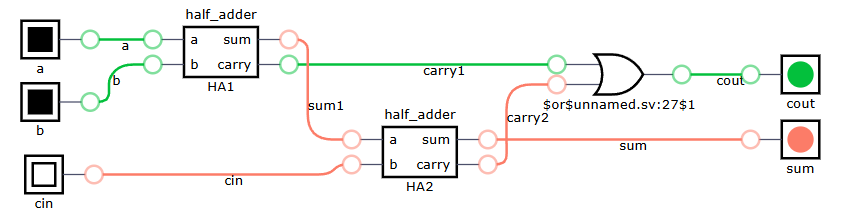

---

### Input Combination: A = 1, B = 1, Cin = 1

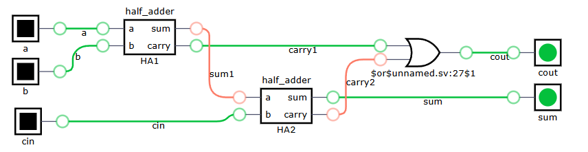

---

## Result

The Half Adder and Full Adder were successfully implemented using Verilog HDL.  
The outputs were checked using all possible input combinations, and the results matched the expected truth tables.

---

## Learning Outcome

From this project, I learned:

- How binary addition works in digital logic
- Difference between Half Adder and Full Adder
- How to design combinational logic circuits
- How to use Verilog modules
- How to connect smaller modules to build a larger circuit
- How to test circuits using different input combinations
- How to organize a hardware project on GitHub

---

## Future Improvements

- Add waveform simulation screenshots
- Add timing analysis report
- Add resource utilization report
- Implement a 4-bit Ripple Carry Adder
- Run the design on an FPGA board

---

## Author

**Nafis-13**  
Hardware Enthusiast | FPGA & Verilog Learner | Digital Logic Design
